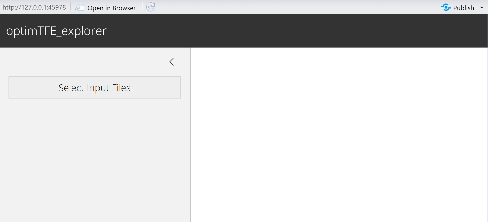
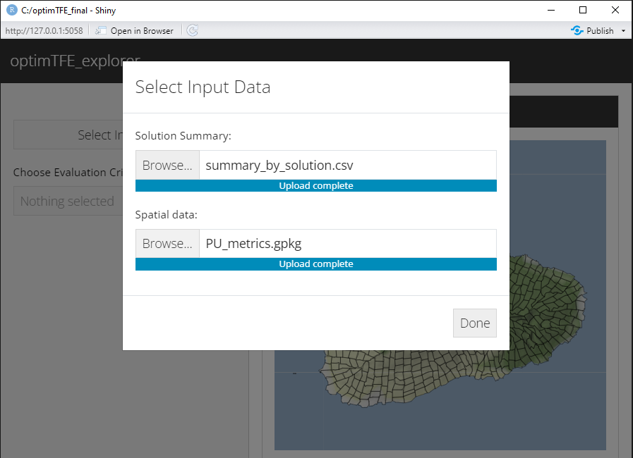
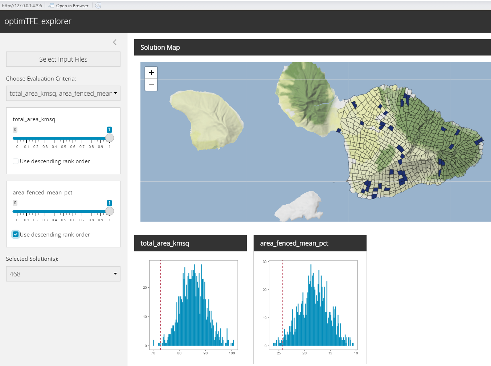

```{r, include = FALSE}
knitr::opts_chunk$set(
  collapse = TRUE,
  comment = "#>"
  #set directory
)
```
```{r klippy, echo=FALSE, include=TRUE}
klippy::klippy()
library(klippy)
```
### Conservation footprint explorer tool: Evaluate tradeoffs across footprint metrics
Here we can evaluate tradeoffs across all conservation footprints using metrics useful
to conservation practitioners.  
For example, we can understand the amount of a footprint that occurs within existing
conservation lands, the proportion of a footprint that occurs within fenced areas
or native habitat, etc.

In order to run the explorer tool there must be a file with metrics of interest
associated with each planning unit. These values can be calculated using zonal
statistics or intersections.  
See the example dataset for pre-processing setup: PU_metrics.gpkg

### Load libraries for running the explorer tool and set project directory

```{r Prep, echo=TRUE, warning=FALSE, message=FALSE}
# Set directory
project_dir <- "C:/optimTFE_final"

# Load packages
library(dplyr)
library(optimTFE)
library(sf)
library(tidyr)
```

### Gather datasets needed
This includes the pu_data spatial file with the planning unit id column and the 
solution summary metrics .csv file created from the 'all_sols_metrics' object in
the optimTFE vignette. Below also demonstrates how to create the files.

```{r Create footprint summary metrics dataset}
# Metrics were calculated already from existing auxiliary datasets
PU_metrics <- read_sf(system.file("extdata", "PU_metrics.gpkg", package = "optimTFE"))

# Merge to get all summary data, footprint metric calculations, and spatial data. This could get
# big,so you may want to subset based on footprint unit count, etc.

# Keep unit_id and solution as columns 1 and 2 followed by columns for getting summary stats 
# (pu area, conservation lands, etc.)

# Load sample_sols100 if not already in the environment; this is in the output folder
# created after running the optimTFE algorithm.
sample_sols100 <- read.csv(file.path(project_dir, "output", "solutions.csv"))

sample_sols100_metrics <- left_join(PU_metrics, sample_sols100, by = c("PU_num" = "unit_id"))
# renaming so we can pull spatial data later if desired
sample_sols100_metrics_df <- as.data.frame(sample_sols100_metrics) |>
  relocate(solution, .after = PU_num) |>
  select(-c(select_order, geom))
# confirm no geometry or geom column

# Example of creating solution summary metric dataframe:
# Make a new df, summarized by solution number. Get solution-level metrics:
solutions_metrics <- sample_sols100_metrics_df |>
  filter(!is.na(solution)) |> #some units do not occur in any solution
  group_by(solution) |>
  summarise(
    total_area_kmsq = sum(area_km2, na.rm = TRUE), # total footprint area
    good_hab_mean_pct = (sum(good_hab_kmsq, na.rm = TRUE) / sum(area_km2, na.rm 
          = TRUE)) * 100, #mean percent of footprint with 'good' habitat
    area_unfenced_mean_pct = (sum(not_fenced_kmsq, na.rm = TRUE) / sum(area_km2,
          na.rm = TRUE)) * 100, #mean percent of footprint unfenced
    area_fenced_mean_pct = (sum(fenced_kmsq, na.rm = TRUE) / sum(area_km2,
          na.rm = TRUE)) * 100,
    cons_lands_mean_pct = (sum(reserved_kmsq, na.rm = TRUE) / sum(area_km2, na.rm 
          = TRUE)) * 100,
    FB_richness_max_mean = mean(max_FB_richness, na.rm = TRUE),
    accessibility_max_mean = mean(max_accessibility, na.rm = TRUE)
  )
# This is the column structure needed as input!

# write.csv(solutions_metrics, file.path(project_dir, "output", "sample_sols100_metrics.csv" ))
```
### Create input dataset formatted for the optimTFE explorer
You will need two files:  
1) Solution summary metrics file created above or from the optimTFE vignette  
2) Solution output file generated from running the optimTFE algorithm

```{r Create solution summary file, warning=FALSE, echo=FALSE}
# If solutions metrics file was already created in optimTFE vignette, read-in dataset:
# solutions_metrics <- read.csv(file.path(project_dir, "output", "sample_sols100_metrics.csv"))|> dplyr::select(-X)
# solution output file from optimTFE algorithm
sample_sols100 <- read.csv(file.path(project_dir, "output", "solutions.csv"))
sols_for_explorer <- sample_sols100 |>
  dplyr::summarise(
    units = as.character(jsonlite::toJSON(unit_id)),
    .by = "solution"
  )
sols_for_explorer <- sols_for_explorer |>
  dplyr::left_join(solutions_metrics, by = "solution")
write.csv(sols_for_explorer, file.path(project_dir, "output", "summary_by_solution.csv"), row.names = FALSE)
```

### Open the explorer

#### It will require two input files
1\) Solution summary file: summary_by_solution.csv created in line 99  
2\) Spatial data file: shapefile or geopackage ** with column labeled PU_num ** indicating
planning unit IDs

```{r Open Explorer, warning=FALSE, message=FALSE, eval = FALSE}
explore_solutions()
```
```{r webtool open, echo=F, out.width = "650px", fig.align="center"}

```

Next, load the two files into the tool.

```{r load data files, echo=F, out.width = "650px", fig.align="center"}

```

Now we can see the loaded metrics. Here is an example with two selected. The drop-down
menu on the bottom left shows the top-ranked conservation footprint when we balance
across two metrics.  
The top-ranked footprint is presented in the map and the dashed red line in the graphs
show where the selection metrics fall across all footprints.  
The bottom drop-down menu allows for selection of multiple footprints. Doing so will
add a dashed line for each footprint. PU transparency will change on the map according
to the number of selected footprints with overlap.  

*Note the check box beneath each metric which allows for selecting descending rank
order.
```{r include metrics, echo=F, out.width = "650px", fig.align="center"}

```

There is a slider bar for each metric that allows users to custom-weight metrics
and evaluate tradeoffs in footprints.  
Default sets all values to 1, which evenly selects across all metrics. Reduce the
slider value to reduce to weight.  
In this example there is a third metric of accessibility, and the sliders have been
adjusted. There are also three footprints mapped, as displayed in the 'selected solutions'
drop-down menu on the bottom left.

```{r slider bars, echo=F, out.width = "650px", fig.align="center"}
knitr::include_graphics("mult_footprints_slider_used.PNG")
```

Now that numerous options have been evaluated, we can select a footprint to look
at more closely using the footprint map vignette.
