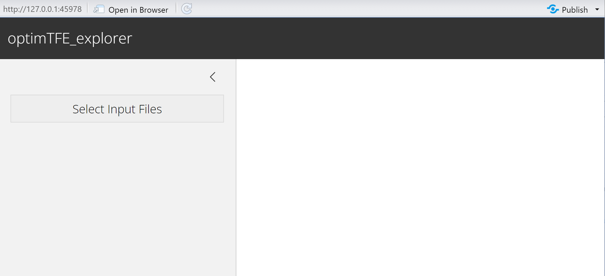
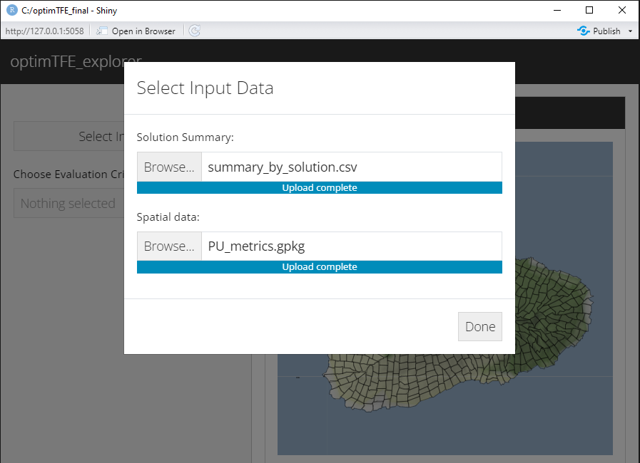

```{r, include = FALSE}
knitr::opts_chunk$set(
  collapse = TRUE,
  comment = "#>"
  #set directory
)
```
```{r klippy, echo=FALSE, include=TRUE}
klippy::klippy()
library(klippy)
```
## Solution explorer tool
### Evaluate tradeoffs across solution metrics
Here we can evaluate tradeoffs across metrics across all solutions. For example,
we can understand the amount of a solution within existing conservation lands, proportion of a solution that occurs within fenced areas or native habitat, etc.

in order to run the explorer tool there must be a file with metrics of interest
associated with each planning unit. These values can be calculated using zonal
statistics or intersections.
See the example dataset for pre-processing setup: PU_metrics.gpkg

## Load libraries for running the explorer tool and set project directory

```{r Prep, echo=TRUE, warning=FALSE, message=FALSE}
library(dplyr)
library(optimTFE)
library(sf)
library(tidyr)

project_dir <- "C:/optimTFE_final"
```

## Gather datasets needed
This includes the pu_data spatial file with the planning unit id column and the 
solution summary metrics .csv file created from the 'all_sols_metrics' object in
the optimTFE vignette. Below also demonstrates how to create the files.

```{r Create solution summary metrics dataset}
# Metrics were calculated already from existing auxiliary datasets
PU_metrics <- read_sf(system.file("extdata", "PU_metrics.gpkg", package = "optimTFE"))

# Merge to get all summary data and solution info, and spatial data. This could get
# big,so you may want to subset based on footprint unit count, etc.

# Keep unit_id and solution as columns 1 and 2 followed by columns for getting summary stats 
# (pu area, conservation lands, etc.)

# Load sample_sols100 if not already in the environment; this is in the output folder
# created after running the optimTFE algorithm.
sample_sols100 <- read.csv(file.path(project_dir, "output", "solutions.csv"))

sample_sols100_metrics <- left_join(PU_metrics, sample_sols100, by = c("PU_num" = "unit_id"))
# renaming so we can pull spatial data later if desired
sample_sols100_metrics_df <- as.data.frame(sample_sols100_metrics) |>
  relocate(solution, .after = PU_num) |>
  select(-c(select_order, geom))
# confirm no geometry or geom column

# Example of creating solution summary metric dataframe:
# Make a new df, summarized by solution number. Get solution-level metrics:
solutions_metrics <- sample_sols100_metrics_df |>
  filter(!is.na(solution)) |> #some units do not occur in any solution
  group_by(solution) |>
  summarise(
    total_area_kmsq = sum(area_km2, na.rm = TRUE), # total footprint area
    good_hab_mean_pct = (sum(good_hab_kmsq, na.rm = TRUE) / sum(area_km2, na.rm 
          = TRUE)) * 100, #mean percent of footprint with 'good' habitat
    area_unfenced_mean_pct = (sum(not_fenced_kmsq, na.rm = TRUE) / sum(area_km2,
          na.rm = TRUE)) * 100, #mean percent of footprint unfenced
    area_fenced_mean_pct = (sum(fenced_kmsq, na.rm = TRUE) / sum(area_km2,
          na.rm = TRUE)) * 100,
    cons_lands_mean_pct = (sum(reserved_kmsq, na.rm = TRUE) / sum(area_km2, na.rm 
          = TRUE)) * 100,
    FB_richness_max_mean = mean(max_FB_richness, na.rm = TRUE),
    accessibility_max_mean = mean(max_accessibility, na.rm = TRUE)
  )
# This is the column structure needed as input!

# write.csv(solutions_metrics, file.path(project_dir, "output", "sample_sols100_metrics.csv" ))
```
## Create input dataset formatted for the optimTFE explorer
You will need two files:
1) Solution summary metrics file created above or from the optimTFE vignette
2) Solution output file generated from running the optimTFE algorithm.

```{r Create solution summary file, warning=FALSE, echo=FALSE}
# If solutions metrics file was already created in optimTFE vignette, read-in dataset:
# solutions_metrics <- read.csv(file.path(project_dir, "output", "sample_sols100_metrics.csv"))|> dplyr::select(-X)
# solution output file from optimTFE algorithm
sample_sols100 <- read.csv(file.path(project_dir, "output", "solutions.csv"))
sols_for_explorer <- sample_sols100 |>
  dplyr::summarise(
    units = as.character(jsonlite::toJSON(unit_id)),
    .by = "solution"
  )
sols_for_explorer <- sols_for_explorer |>
  dplyr::left_join(solutions_metrics, by = "solution")
write.csv(sols_for_explorer, file.path(project_dir, "output", "summary_by_solution.csv"), row.names = FALSE)
```

## Open the explorer

### It will require two input files
1) Solution summary file: summary_by_solution.csv created in line 99
2) Spatial data file: shapefile or geopackage ** with column labeled PU_num ** indicating
planning unit IDs

The loaded page appears here.
```{r Open Explorer, warning=FALSE, message=FALSE, eval = FALSE}
explore_solutions()
```
```{r webtool open, echo=F, out.width = "500px", fig.align="center"}

```

Next, load the two files into the tool.

```{r load data files, echo=F, out.width = "500px", fig.align="center"}

```

