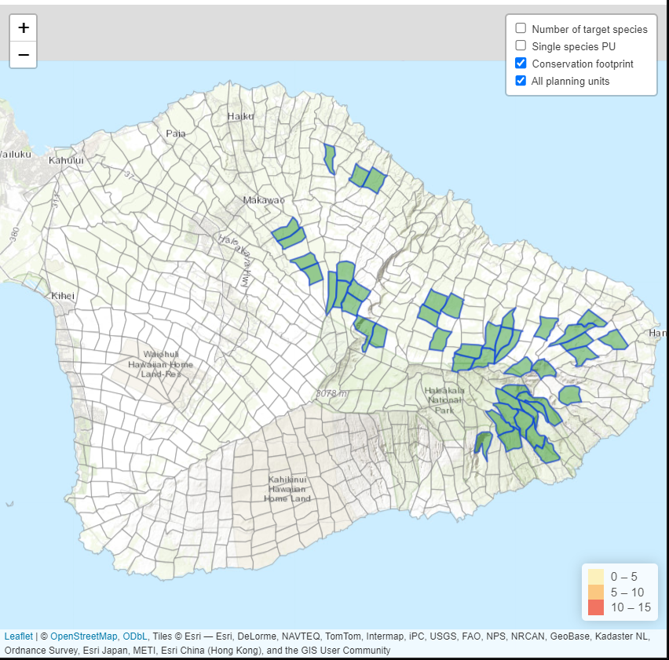
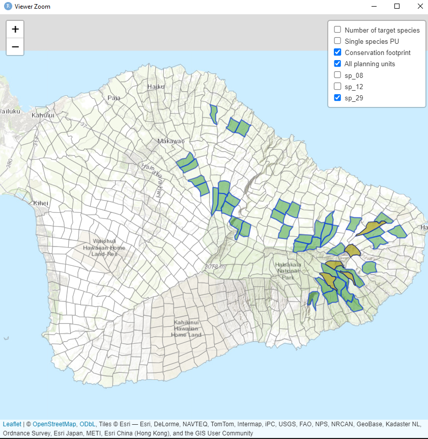
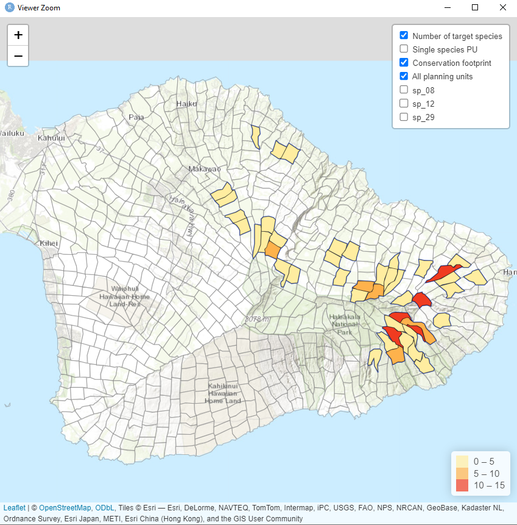
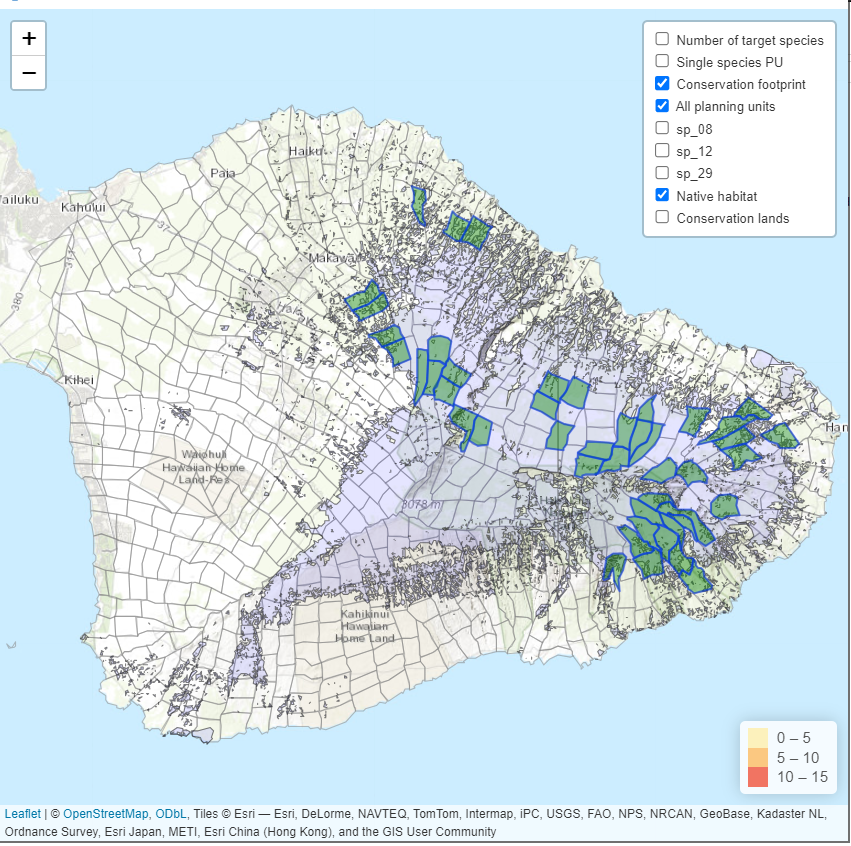

```{r setup, include = FALSE}
knitr::opts_chunk$set(
  collapse = TRUE,
  comment = "#>"
)
```
```{r klippy, echo=FALSE, include=TRUE}
klippy::klippy()
library(klippy)
```
### Introduction
This vignette will demonstrate how to create a leaflet application to display a
conservation footprint generated from the optimTFE algorithm.
We will use the solutions output generated from the algorithm, and then additional
spatial data of interest.
*Note: There is an option to generate an html document for sharing the map.
```{r Prep, echo=TRUE, warning=FALSE, message=FALSE}
knitr::opts_chunk$set(warning = FALSE)
# Set directory
project_dir <- "optimTFE_project"

# Load packages
library(optimTFE)
library(sf)
library(dplyr)
library(tidyverse)
library(leaflet)
library(leaflet.providers)
library(htmltools)
library(htmlwidgets)
```

#### Bring in datasets
Datasets to create the footprint map include the solutions output, planning unit polygon data,
and additional spatial data such existing conservation lands, native habitat, etc.  
All files of interest need to be added to this list.  
**Note:** Currently this tool can only accept .shp or .gpkg spatial data.
We can also map selected PUs of individual species in the map using the solutions output.
Use the species names as listed in the PU_polygons file to plot correctly on the map.
```{r Setup datasets, echo=TRUE}

# enter the filepath to "solutions.csv" generated from the optimTFE algorithm
solution_file <- read.csv(file.path(project_dir, "output", "solutions.csv"))

PU_polygons <- optimTFE::units_spp_suit #spatial data with PU_id and species suitability values

native_cons_lands <- list(
  list(name = "Native habitat", filename = system.file("extdata", "native_habitat.shp", package = "optimTFE"), hidden = T),
  list(name = "Conservation lands", filename = system.file("extdata", "reserves.shp", package = "optimTFE"), hidden=T))
map_spp <- list(
  list(species = "sp_08", hidden=T),
  list(species = "sp_12", hidden=T),
  list(species = "sp_29", hidden=T)
)
```

#### Create a conservation footprint map
```{r Create a conservation footprint map, warning=FALSE, message=FALSE, eval = FALSE}
# Conservation footprint showing conservation footprint; set solution number manually.
create_interactive_map(solution_file, PU_polygons, selected_sol_index=35)
```
```{r basic footprint open, echo=F, out.width = "650px", fig.align="center"}

```

#### Create footprint map with target species PUs displayed
It is possible to toggle on and off the PUs selected for a given set of species
by ticking the 'map_individual_species' box in the upper right legend. 
```{r footprint map with species list, warning=FALSE, message=FALSE, eval = FALSE}
# Solution 35 showing conservation footprint and individual species target distributions
create_interactive_map(solution_result_file = solution_file, original_PU_polygons = PU_polygons, selected_sol_index=35, map_individual_spp = map_spp)
```
```{r show map of footprint with map_individual_spp, echo=F, out.width = "650px", fig.align="center"}

```

#### Create heatmap of species within each PU
Tick the option 'Number of target species' in the upper right legend to view a heatmap
of species within a selected footprint.
```{r num_target_species, echo=F, out.width = "650px", fig.align="center"}

```

#### Create a conservation footprint map with target species and additional spatial data
Include the 'add_auxiliary_layers' option to the create_interactive_map function
to add context to a footprint. The image below shows a conservation footprint with 
a map of existing native habitat.
```{r Create footprint map with target species list and additional spatial data, warning=FALSE, message=FALSE, eval=FALSE}
# Solution 35 showing conservation footprint, additional spatial layers for reference,
# and individual species target distributions
create_interactive_map(solution_result_file = solution_file, original_PU_polygons = PU_polygons,
                       auxiliaryLayers = native_cons_lands,  selected_sol_index=35, map_individual_spp = map_spp)
```
```{r footprint map with native habitat map overlay, echo=F, out.width = "650px", fig.align="center"}

```

**To save a shareable .html conservation footprint, add and define 'save_HTML_loc = '**  
Example:
create__interactive_map(solution_file, PU_polygons, selected_sol_index=35, auxiliaryLayers = native_cons_lands, map_individual_spp = map_spp, save_HTML_loc = file.path(project_dir, "footprint35.html"))
