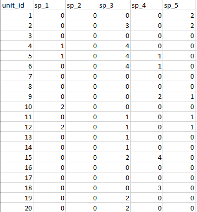
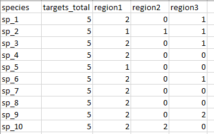

```{r setup, include = FALSE}
knitr::opts_chunk$set(
  collapse = TRUE,
  comment = "#>"
)
```
### Introduction
This vignette will explain and demonstrate how to setup data files for using the
populations and bioregions components of the optimTFE package.  
If you have not first explored the optimTFE vignette, please explore it before
using the populations or bioregions functions.

#### Purpose of existing populations function
When conservation practitioners are planning for species recovery, it often includes
planning for recovery of populations. And, often there are existing populations
or individuals that practitioners want to prioritize.  
The option to account for existing populations is found in the 'spp_pops_fn'
function. Each distinct population should be uniquely named; alphanumeric codes
are accepted. Populations can span more than 1 PU.

If this function is used, the optimTFE algorithm will preferentially select existing
populations. This function interacts with the bioregions function, explained below.

#### Existing populations data setup
Usinng a .csv format, unit_id must be the first column. Then, list species in the
same order as listed in the species suitability input file.  
The matrix will likely be mostly 0s, with a single population or individual labeled
uniquely from other, separate populations.

A PU cannot be assigned to more than one population for a given species.

```{r populations setup, echo=F, out.width = "400px", fig.align="center"}

```

#### Purpose of bioregions function
When setting recovery goals, there are often additional constraints beyond the number
of populations required. A recovery plan may cite a number populations that must 
span distinct ecological units, counties, etc. 
The sub_regions_fn function can be used to meet targets across multiple regions.
                                                                              
Although the term bioregion has an ecological context, it can be used to create 
distinct units for any purpose. Identifying bioregions is optional, and if used,
all PUs do not need to be assigned to a region.  
The bioregion dataset must be in .csv format, with unit_id as the first column,
and distinct unit names following in subsequent columns. This will be a matrix of
1s and 0s; 1s indicate the bioregion, 0s indicate it is not designated to the region(s).

Not all PUs must be assigned to a region, but ensure all columns for the
given PU are 0s.  

**NOTE:** A PU can be assigned only to a single region.

Below is an example of the bioregions format. This includes no region assignment
for PUs 6 and 7 (unit_id in the dataset).
```{r bioregions setup, echo=F, out.width = "300px", fig.align="center"}
knitr::include_graphics("./vignette_images/bioregions_setup_nocircle.png")
```

###### Updating the target file with bioregion targets
In addition, the number of PUs per bioregion must be indicated in the target .csv.
The target file must first include the overall targets, and then a  column for each
region must follow, in the same order as in the subregions .csv file.  

Targets across bioregions must not be greater than the number of total targets listed
in column 2 of the targets .csv. Targets cannot exceed the total number of PUs.
This applies to both bioregion targets and overall targets.

```{r bioregions targets setup, echo=F, out.width = "400px", fig.align="center"}

```

#### Using population and bioregion functions together
If using both the population and bioregion functions, it is important to understand
how the two may interact.  
1)  A population may not span bioregions  
2) Populations will be preferentially selected to meet bioregion and overall targets,
but if a bioregion does not contain enough populations to meet the bioregion targets
it will use suitability values.  
This is regardless of whether the total number of
populations is greater than the total target.  

**Example:** There are 5 populations for sp_1: 2 in bioregion1, 2 in bioregion2,
and one in bioregion3.  
The total target is 4, bioregion1 has a target of 3 and bioregion3 has a target of 1.  
The optimTFE algorithm will select a PU for both populations in bioregion1, another
PU based on suitability values, and a PU for the population in bioregion3 to meet
the target of 4.


